# Battle of Britain NAV — Temora 2026

- **Event:** Airtourer Association Convention, Temora 2026
- **Date:** Saturday 23 May 2026
- **Departure / Return:** Temora Aerodrome (YTEM), NSW, Australia
- **Source:** Typewritten "EYES ONLY" briefing pack, 10 scanned pages (`./instructions/IMG_4230.jpeg` through `./instructions/IMG_4239.jpeg`). The page scans are in landscape orientation; the typed text reads when the image is viewed rotated 90° clockwise.

---

## 1. Summary of the navigation task

A Battle-of-Britain-themed VFR navigation exercise flown out of Temora in
Airtourer / Airtrainer aircraft. The triangle Temora — West Wyalong —
Cootamundra is treated as the (slightly larger) analogue of the
Duxford — London — Thames Estuary triangle that Douglas Bader's "Big
Wing" Spitfires operated over in 1940. Cruise altitudes of 2,000–4,000 ft
match the typical Battle of Britain dogfight band, and the briefing
emphasises that this is a dead-reckoning exercise — skills "getting rusty
in the era of follow the magenta line".

The flight is structured as one "Big Wing" formation leg followed by
individual navigation, with a forward-reconnaissance role tasked at the
front:

1. Depart Temora as a formation; the lead recon Airtourer/Airtrainer
   navigates to **Checkpoint Yankee**, located approximately
   26 km west of West Wyalong. Position can also be computed from the
   Spitfire's report (4 minutes from YWWL at the normal RAF cross-country
   cruise of ~250 mph TAS on heading 295°M, wind 360°T at 30 kt).
2. **Enroute, deviate to identify a suspicious ground installation**
   ~15 sm from Temora, ~2.5 sm east of the Goldfields Way, ~5 nm
   starboard of the Temora→Yankee course. Identify but do **not** orbit
   (traffic separation with following aircraft).
3. Continue to **Checkpoint Yankee**; identify it against the supplied
   reconnaissance photo and fly a single **LEFT-HAND orbit only**.
4. **Divert to West Wyalong (YWWL)** — the Big Wing formation
   disbands here per the formation briefing.
5. Track **YWWL → Young (YYNG)**. At the intersection of that track with
   the **034°M radial from Temora**, divert and track generally **south
   to Cootamundra (YCTM)**.
6. **Return to Temora** for a spot-landing contest, then refreshments at
   the AeroClub.

A quiz threads through the whole flight: identify the installation, name
the town passed over on the YWWL→YYNG leg (silo count and quadrant,
WAC-chart accuracy, grain type, railway status), and answer Cootamundra
aviation-history questions (the original "Paddocks" name of the field,
the famous DH-6 pilot of 5 Apr 1919, which 1930s aircraft/pilots stopped
there, WWII RAAF training aircraft, and which listed regional airlines
actually served the town).

---

## 2. Route overview

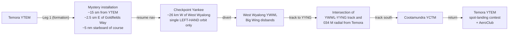

Reference distances and timings the briefing flags:

- Triangle Temora–West Wyalong–Cootamundra is slightly larger than
  Duxford–London–Thames Estuary.
- Formation leg ~20–30 minutes.
- Spitfire wartime cross-country cruise ~250 mph; Airtourer/Airtrainer
  cruise ~125 mph, so this leg takes roughly twice as long as the
  Battle of Britain Spitfires would have flown the equivalent.
- Typical Battle of Britain dogfight altitudes 2,000–4,000 ft (a normal
  cruise band for the trial aircraft as well).

---

## 3. Leg-by-leg tasks (consolidated)

### Leg 1 — Temora → Checkpoint Yankee (formation)

- The "Big Wing" is made up of those interested in flying the first leg
  in formation; individual Airtourer / Airtrainer aircraft act as forward
  reconnaissance.
- **Locating Checkpoint Yankee.** The Spitfire's recon report:
  - Flying westerly from West Wyalong, heading **295°M**.
  - Checkpoint Yankee spotted **4 minutes** out of YWWL at the normal
    RAF cross-country cruise (see power-setting table — 2400 RPM /
    +4 boost ≈ **250 mph TAS**).
  - Prevailing wind **360°T at 30 kt**.
  - Cross-check: the recon photo on page 10 marks Checkpoint Yankee as
    **"Ca 26 km West Wyalong"**.
- **Identify it against the attached reconnaissance photo (page 10)**
  and fly a single **LEFT-HAND orbit only** at Checkpoint Yankee for
  traffic separation.
- Recon-photo quiz (item 6):
  - Can you identify any landmarks?
  - If you had engine trouble, where would you land?
  - Identify potential landing sites on the reconnaissance photo.

### Side-task — Mystery ground installation (item 3)

- Reported by ground staff:
  - ~**15 statute miles** from Temora.
  - ~**2.5 statute miles east** of the Goldfields Way.
  - ~**5 nautical miles starboard** of the Temora→Yankee course.
- **Deviate off course and investigate.** **Do NOT orbit** — following
  aircraft need the airspace.
- Identification (item 4) — pick one:
  1. A munitions dump
  2. A solar farm
  3. A piggery
  4. A POW camp
  5. Green houses

### Leg 2 — Checkpoint Yankee → West Wyalong (item 7)

- Divert to West Wyalong (YWWL).
- The Big Wing formation disbands at YWWL per the formation briefing.

### Leg 3 — YWWL → (intersection) → Cootamundra (items 8–9)

- Track from **YWWL to YYNG** (Young).
- At the intersection of that track with the **034°M line from Temora**,
  divert and track **generally south to Cootamundra (YCTM)**.
- Pass-over-town quiz (page 4):
  - What town do you pass over?
  - How many silos are at the town?
  - Are they located NE, NW, SE or SW of the road intersection?
  - Is the silo marked on the WAC charts in the correct location?
  - What grains are the silos used for?
  - Is the railway line active?

### Cootamundra history quiz (items 10–13)

- **Item 10 — First landing 5 Apr 1919, two DH-6 aircraft Melbourne→Sydney.**
  - (a) The field was known as "XXXXXXX Paddocks" before it became an
    official airport. What was the name? *Hint: an airport road contains
    one of the names.*
  - (b) One of the two pilots later set a number of record-breaking
    flights. Who?
- **Item 11 — Which of these 1930s rest-stop visitors actually landed at
  Cootamundra?** (circle):
  - PG Taylor — DH-6
  - Sir Ross and Sir Keith Smith — Vickers Vimy *G-EAOU*
  - Bert Hinkler — Avro Avian
  - Sir Charles Kingsford Smith — Fokker Trimotor *VH-USU*
  - KLM DC-2
  - Freda Thomson — DH 87 Hornet Moth
  - Amelia Earhart — Vega 5B
  - Dick Smith — Bell Jetranger
- **Item 12 — RAAF training base, 1940–1946.** Name as many RAAF aircraft
  types that operated from Cootamundra as you can.
- **Item 13 — Regional airlines: strike out the incorrect ones.**
  - Butler Air Transport
  - Larkin Aircraft Services
  - Masling
  - Airland
  - Trans Australian Airlines
  - East-West Airlines
  - Australian Aerial Services
  - Australia National Airways
  - REX Airlines

### Legs 4–5 — Return and social (items 14–15)

- Return to Temora for a **spot-landing contest**.
- Adjourn to the AeroClub for refreshments.

The briefing notes that Cootamundra is worth a future stop — cafés,
museums, and Donald Bradman's childhood home are all within ~2 km of the
airport terminal — but the trial day's programme doesn't allow a landing
there.

---

## 4. Spitfire Mk I — power-setting reference (page 7)

Compiled from RAF Air Ministry Pilot's Notes and period Merlin
engine-handling data, for the Supermarine Spitfire Mk I with the
Rolls-Royce Merlin II or III engine.

| Condition          | RPM       | Boost (lb/in²) | Approx TAS    | Fuel consumption |
|--------------------|-----------|----------------|---------------|------------------|
| Economy cruise     | 1850      | +1             | ~180–200 mph  | ~28–32 gal/hr    |
| Normal cruise      | 2200–2400 | +2 to +4       | ~220–260 mph  | ~40–55 gal/hr    |
| High-speed cruise  | 2600      | +6             | ~290–315 mph  | ~70 gal/hr       |
| Maximum continuous | 2650      | +6.25          | ~320 mph      | High             |
| Takeoff / combat   | 3000      | +12            | 360+ mph      | Very high        |

**Operational notes**

- Typical RAF cross-country cruise: 2400 RPM, +4 boost, ~250 mph TAS at altitude.
- Economy patrol setting: 1850 RPM and +1 boost for endurance and ferrying.
- Approximate internal fuel capacity: 85 Imperial gallons.
- Normal combat radius: approximately 180–250 miles.
- Maximum ferry range: approximately 575 miles under economy cruise settings.
- Best fuel efficiency typically around 15,000–20,000 ft altitude.

---

## 5. Reconnaissance photographs

The briefing pack includes three pages of reconnaissance imagery:

- **Page 8** (`./instructions/IMG_4237.jpeg`) — four oblique aerial
  photographs of a rural property complex (used for the landmark /
  forced-landing-site quiz at item 6).
- **Page 9** (`./instructions/IMG_4238.jpeg`) — a single large oblique
  aerial photograph of farm paddocks with scattered buildings, dams,
  tree lines, and a cleared strip.
- **Page 10** (`./instructions/IMG_4239.jpeg`) — vertical aerial
  intelligence photograph styled as a captured Luftwaffe target sheet,
  marked **CHECKPOINT YANKEE** and **"Ca 26 km West Wyalong"**.
  German legend at the bottom:

  > **G.B. 10 69    Fliegerhorst** *(airbase)*
  >
  > 1. 3 Flugzeughallen — *3 aircraft hangars*
  > 2. 1 Flugzeughalle, zerstört — *1 aircraft hangar, destroyed*
  > 3. Unterkunftsgebäude, zerstört — *accommodation building, destroyed*
  > 4. Splittersichere Abstellplätze f. Flugzeuge — *blast-protected aircraft dispersal pens*
  > 5. Flakstellungen — *flak (AA-gun) positions*
  > 6. Kläranlage — *sewage treatment plant*
  > 7. Scheinwerferstellung — *searchlight position*

---

# Verbatim page-by-page transcript

Each section below is a literal transcription of the corresponding
scanned page. The "EYES ONLY" stamp and the round Airtourer Association
Convention — Temora 2026 logo appear on every typewritten page and are
not repeated in the transcription.

## Page 1 — Briefing introduction

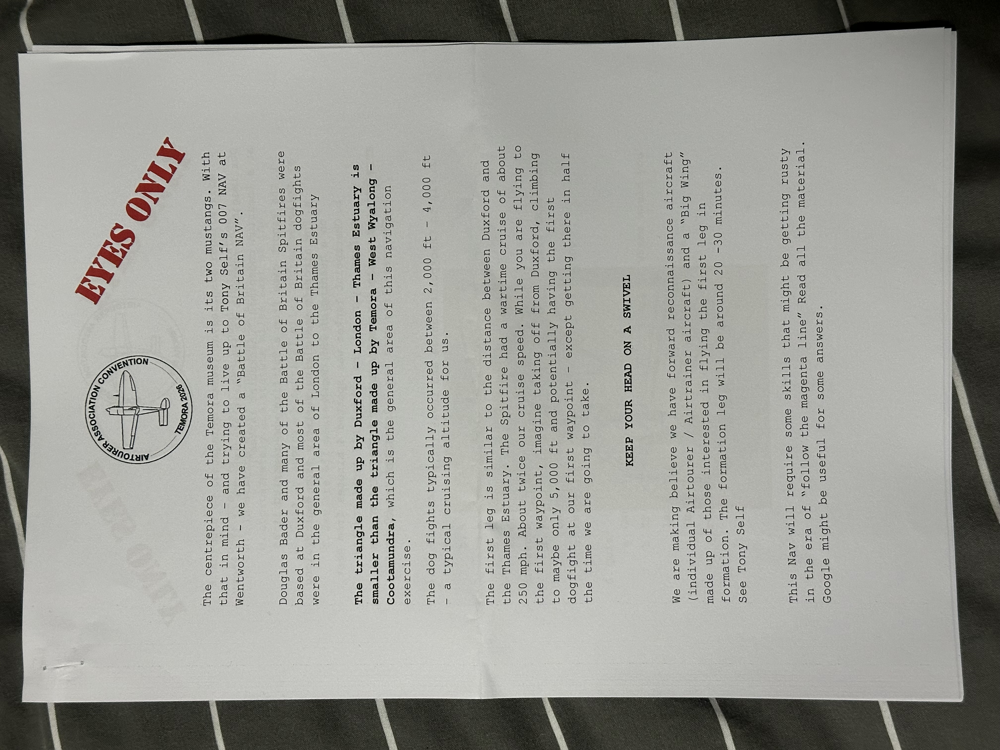

> The centrepiece of the Temora museum is its two mustangs. With that in
> mind — and trying to live up to Tony Self's 007 NAV at Wentworth — we
> have created a "Battle of Britain NAV".
>
> Douglas Bader and many of the Battle of Britain Spitfires were based
> at Duxford and most of the Battle of Britain dogfights were in the
> general area of London to the Thames Estuary.
>
> **The triangle made up by Duxford – London – Thames Estuary is smaller
> than the triangle made up by Temora – West Wyalong – Cootamundra**,
> which is the general area of this navigation exercise.
>
> The dog fights typically occurred between 2,000 ft – 4,000 ft — a
> typical cruising altitude for us.
>
> The first leg is similar to the distance between Duxford and the
> Thames Estuary. The Spitfire had a wartime cruise of about 250 mph.
> About twice our cruise speed. While you are flying to the first
> waypoint, imagine taking off from Duxford, climbing to maybe only
> 5,000 ft and potentially having the first dogfight at our first
> waypoint — except getting there in half the time we are going to take.
>
> **KEEP YOUR HEAD ON A SWIVEL**
>
> We are making believe we have forward reconnaissance aircraft
> (individual Airtourer / Airtrainer aircraft) and a "Big Wing" made up
> of those interested in flying the first leg in formation. The
> formation leg will be around 20 – 30 minutes.
>
> This Nav will require some skills that might be getting rusty in the
> era of "follow the magenta line". Read all the material. Google might
> be useful for some answers.
>
> See Tony Self

## Page 2 — Scenario and tasks 1–2

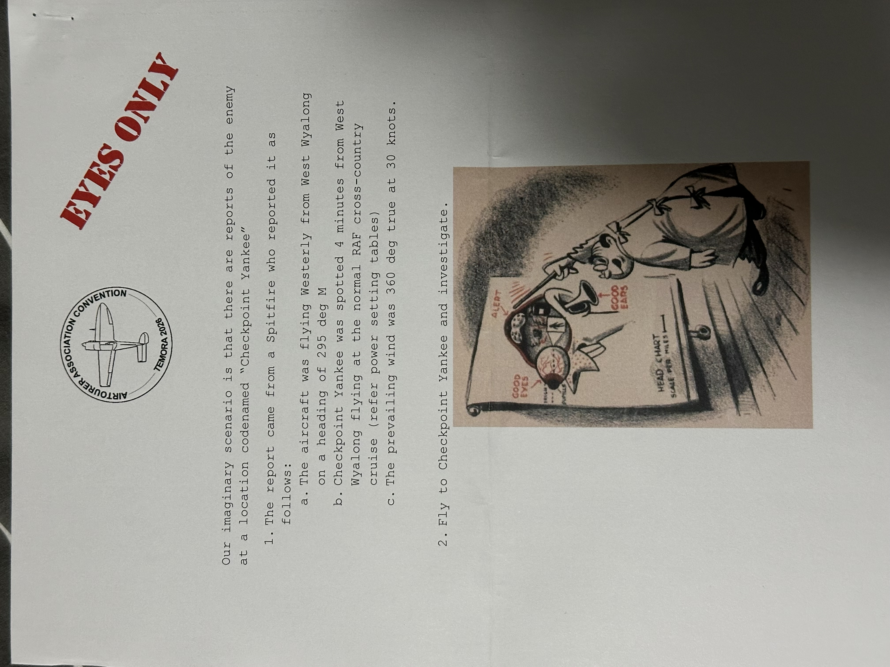

> Our imaginary scenario is that there are reports of the enemy at a
> location codenamed **"Checkpoint Yankee"**.
>
> 1. The report came from a Spitfire who reported it as follows:
>    a. The aircraft was flying Westerly from West Wyalong on a heading
>       of **295 deg M**.
>    b. Checkpoint Yankee was spotted **4 minutes** from West Wyalong
>       flying at the normal RAF cross-country cruise (refer power
>       setting tables).
>    c. The prevailing wind was **360 deg true at 30 knots**.
>
> 2. Fly to Checkpoint Yankee and investigate.

The page also carries a small period cartoon of a flight-briefing scene
(briefer in front of a "HELD CHART SCALE PER MILES" board, with labels
"GOOD EYES", "GOOD EARS", "ALERT").

## Page 3 — Tasks 3–6

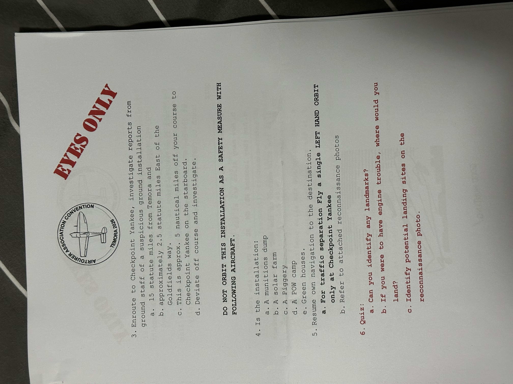

> 3. Enroute to Checkpoint Yankee, investigate reports from ground staff
>    of a suspicious ground installation.
>    a. 15 statute miles from Temora and approximately 2.5 statute miles
>       East of the Goldfields way.
>    b. Approximately 5 nautical miles off your course to Checkpoint
>       Yankee on the starboard.
>    c. This is approx.
>    d. Deviate off course and investigate.
>
> **DO NOT ORBIT THIS INSTALLATION AS A SAFETY MEASURE WITH FOLLOWING
> AIRCRAFT.**
>
> 4. Is the installation:
>    a. A munitions dump
>    b. A solar farm
>    c. A piggery
>    d. A POW camp
>    e. Green houses.
>
> 5. Resume own navigation to the destination.
>    **a. For traffic separation Fly a single LEFT HAND ORBIT only at
>       Checkpoint Yankee**
>    b. Refer to attached reconnaissance photos.
>
> 6. **Quiz:**
>    a. Can you identify any landmarks?
>    b. If you were to have engine trouble, where would you land?
>    c. Identify potential landing sites on the reconnaissance photo.

## Page 4 — Tasks 7–9 and pass-over-town quiz

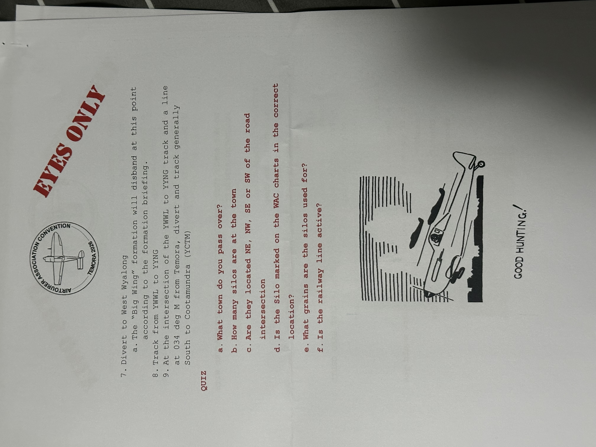

> 7. Divert to West Wyalong.
>    a. The "Big Wing" formation will disband at this point according to
>       the formation briefing.
> 8. Track from YWWL to YYNG.
> 9. At the intersection of the YWWL to YYNG track and a line at 034 deg
>    M from Temora, divert and track generally South to Cootamundra
>    (YCTM).
>
> **QUIZ**
>
> a. What town do you pass over?
> b. How many silos are at the town?
> c. Are they located NE, NW, SE or SW of the road intersection?
> d. Is the silo marked on the WAC charts in the correct location?
> e. What grains are the silos used for?
> f. Is the railway line active?
>
> **GOOD HUNTING!**

The page also carries a small line drawing of a single-engine aircraft
in flight.

## Page 5 — Cootamundra history tasks 10–12

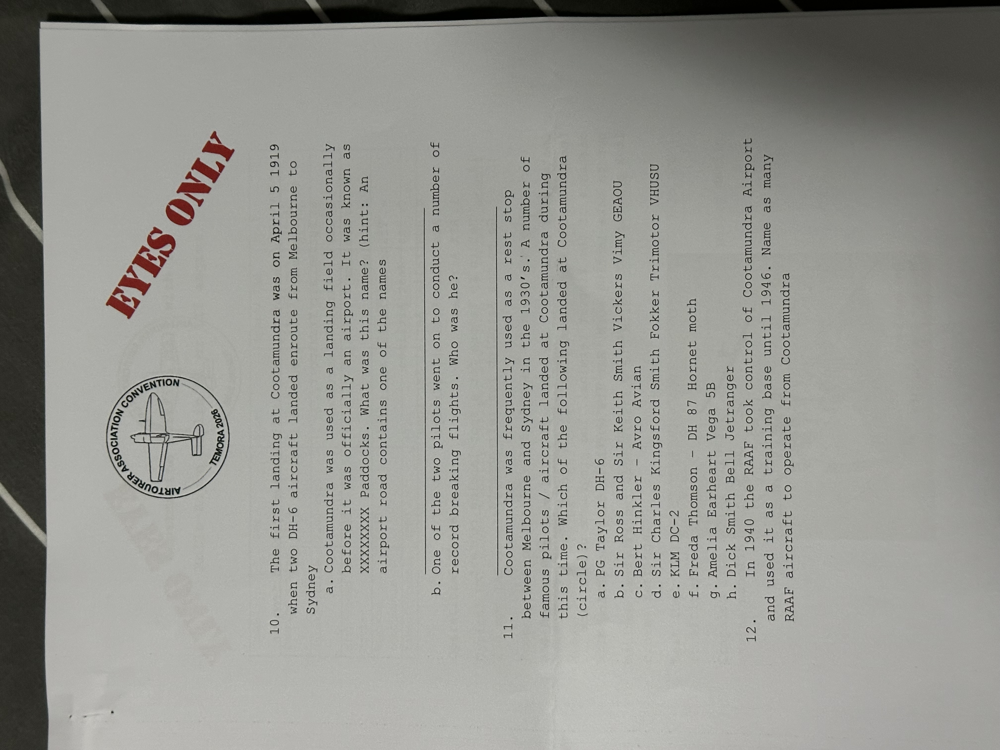

> 10. The first landing at Cootamundra was on April 5 1919 when two DH-6
>     aircraft landed enroute from Melbourne to Sydney.
>     a. Cootamundra was used as a landing field occasionally before it
>        was officially an airport. It was known as XXXXXXX Paddocks.
>        What was this name? (hint: An airport road contains one of the
>        names.)
>     b. One of the two pilots went on to conduct a number of record
>        breaking flights. Who was he? ______________________
>
> 11. Cootamundra was frequently used as a rest stop between Melbourne
>     and Sydney in the 1930's. A number of famous pilots / aircraft
>     landed at Cootamundra during this time. Which of the following
>     landed at Cootamundra (circle)?
>     a. PG Taylor DH-6
>     b. Sir Ross and Sir Keith Smith Vickers Vimy GEAOU
>     c. Bert Hinkler – Avro Avian
>     d. Sir Charles Kingsford Smith Fokker Trimotor VHUSU
>     e. KLM DC-2
>     f. Freda Thomson – DH 87 Hornet moth
>     g. Amelia Earheart Vega 5B
>     h. Dick Smith Bell Jetranger
>
> 12. In 1940 the RAAF took control of Cootamundra Airport and used it
>     as a training base until 1946. Name as many RAAF aircraft to
>     operate from Cootamundra.

## Page 6 — Tasks 13–15 and Cootamundra footnote

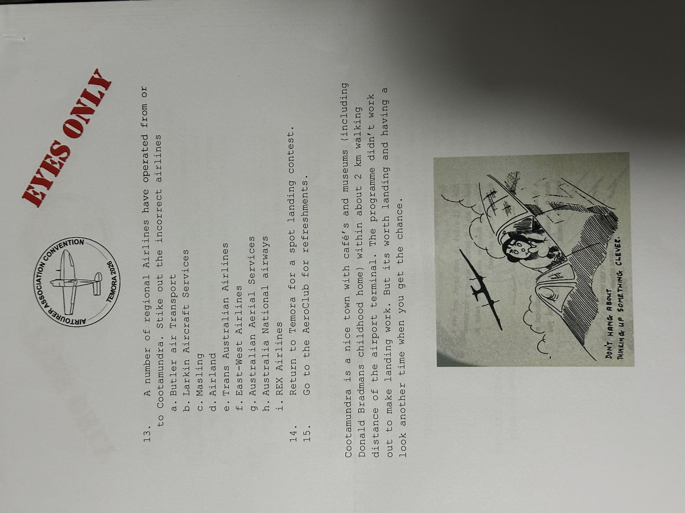

> 13. A number of regional Airlines have operated from or to
>     Cootamundra. Strike out the incorrect airlines.
>     a. Butler air Transport
>     b. Larkin Aircraft Services
>     c. Masling
>     d. Airland
>     e. Trans Australian Airlines
>     f. East-West Airlines
>     g. Australian Aerial Services
>     h. Australia National airways
>     i. REX Airlines
>
> 14. Return to Temora for a spot landing contest.
> 15. Go to the AeroClub for refreshments.
>
> Cootamundra is a nice town with cafe's and museums (including Donald
> Bradman's childhood home) within about 2 km walking distance of the
> airport terminal. The programme didn't work out to make landing work.
> But it's worth landing and having a look another time when you get the
> chance.

The page also carries a small cartoon of a pilot in an open-cockpit
biplane with the caption **"DON'T HANG ABOUT THINKING UP SOMETHING
CLEVER."**

## Page 7 — Spitfire Mk I power-setting table

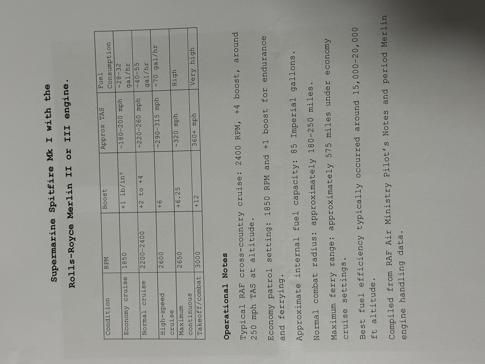

> **Supermarine Spitfire Mk I with the Rolls-Royce Merlin II or III
> engine.**

| Condition          | RPM       | Boost (lb/in²) | Approx TAS    | Fuel consumption |
|--------------------|-----------|----------------|---------------|------------------|
| Economy cruise     | 1850      | +1             | ~180–200 mph  | ~28–32 gal/hr    |
| Normal cruise      | 2200–2400 | +2 to +4       | ~220–260 mph  | ~40–55 gal/hr    |
| High-speed cruise  | 2600      | +6             | ~290–315 mph  | ~70 gal/hr       |
| Maximum continuous | 2650      | +6.25          | ~320 mph      | High             |
| Takeoff / combat   | 3000      | +12            | 360+ mph      | Very high        |

> **Operational Notes**
>
> Typical RAF cross-country cruise: 2400 RPM, +4 boost, around 250 mph
> TAS at altitude.
>
> Economy patrol setting: 1850 RPM and +1 boost for endurance and
> ferrying.
>
> Approximate internal fuel capacity: 85 Imperial gallons.
>
> Normal combat radius: approximately 180–250 miles.
>
> Maximum ferry range: approximately 575 miles under economy cruise
> settings.
>
> Best fuel efficiency typically occurred around 15,000–20,000 ft
> altitude.
>
> Compiled from RAF Air Ministry Pilot's Notes and period Merlin engine
> handling data.

## Page 8 — Reconnaissance photographs (4-up oblique aerials)

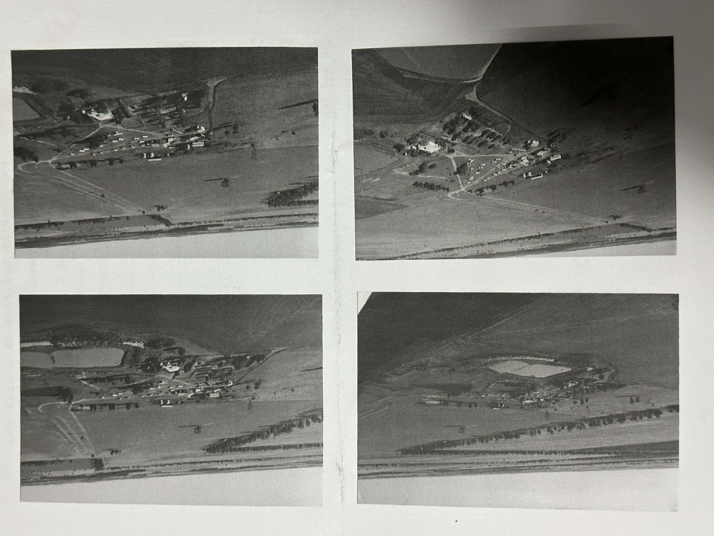

Image-only page. Four black-and-white oblique aerial photographs of the
same small rural property complex from different angles — visible
elements include a cluster of farm buildings, a small dam, fenced
paddocks, scattered trees, and an unsealed track / driveway. These are
the "attached reconnaissance photos" referenced by item 5b and the
quiz item 6c (identify landmarks and potential forced-landing sites).

## Page 9 — Reconnaissance photograph (single oblique aerial)

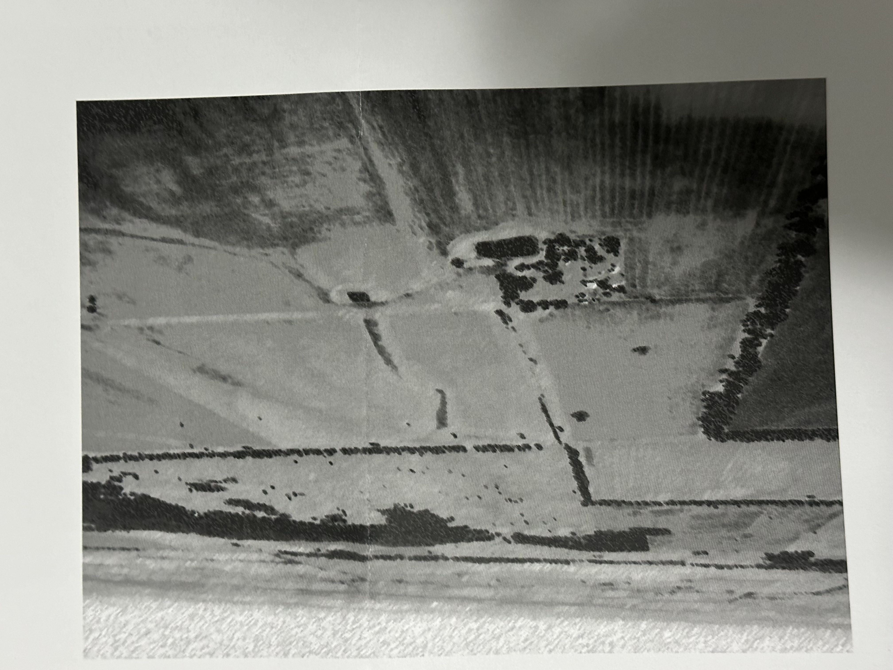

Image-only page. A single larger black-and-white oblique aerial
photograph of open farm country: cultivated paddocks divided by fence
lines and tree belts, a small dam ringed by trees, a homestead cluster
in the foreground, and a longer cleared strip running across the
middle distance.

## Page 10 — Checkpoint Yankee intelligence photograph

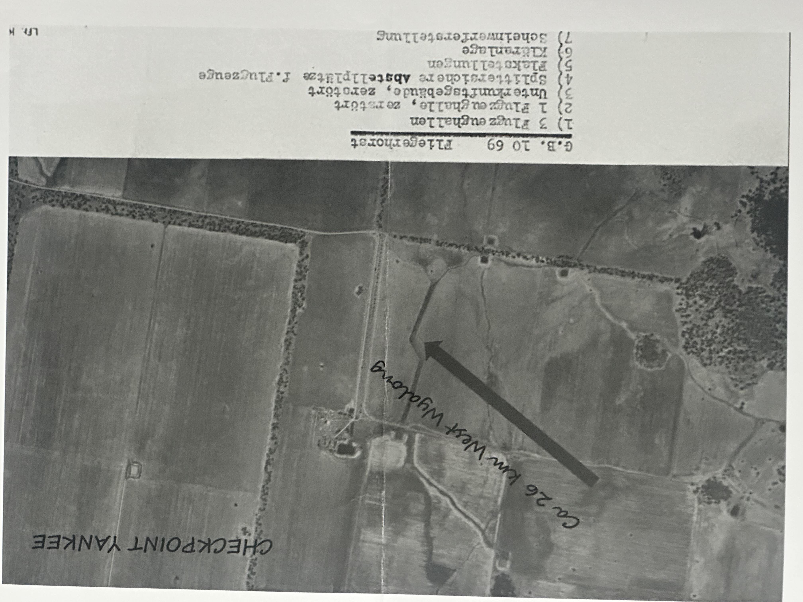

Vertical (top-down) aerial photograph styled as a captured Luftwaffe
target dossier. Hand-lettered annotations:

- **"CHECKPOINT YANKEE"** (upper right).
- Bold arrow with the legend **"Ca 26 km West Wyalong"** pointing into
  the photo (i.e. Checkpoint Yankee lies approximately 26 km west of
  West Wyalong).

Typed legend across the bottom of the sheet (German, *with English glosses*):

> **G.B. 10 69    Fliegerhorst** — *airbase*
>
> 1. 3 Flugzeughallen — *3 aircraft hangars*
> 2. 1 Flugzeughalle, zerstört — *1 aircraft hangar, destroyed*
> 3. Unterkunftsgebäude, zerstört — *accommodation building, destroyed*
> 4. Splittersichere Abstellplätze f. Flugzeuge — *blast-protected aircraft dispersal pens*
> 5. Flakstellungen — *flak (anti-aircraft) gun positions*
> 6. Kläranlage — *sewage treatment plant*
> 7. Scheinwerferstellung — *searchlight position*

A reference marking "Lfl. H" appears in the lower-right corner of the
sheet (Luftflotte H — the typical *Luftwaffenführungsstab* aerial target
folder annotation).
